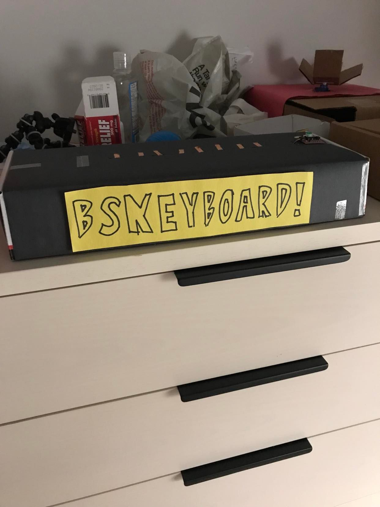
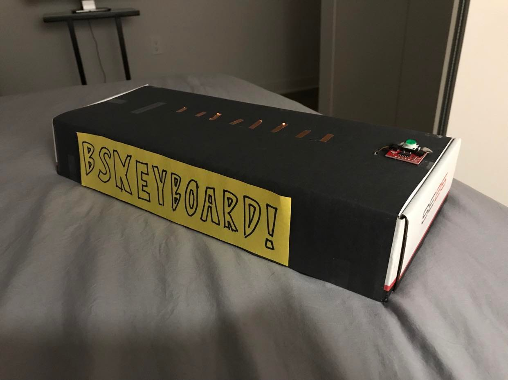
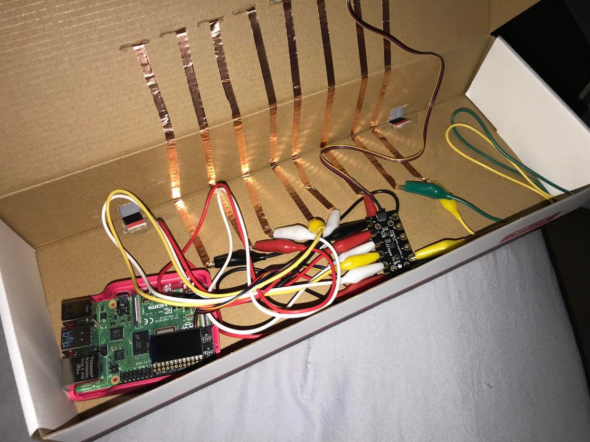
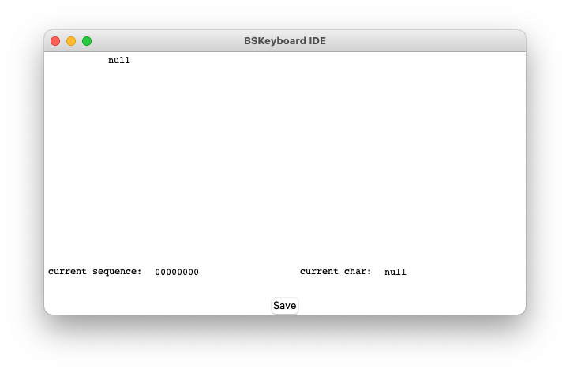

# BSKeyboard: the Write-Up



## The Why

Why did I bother making this thing? What's the point of having a keyboard that forces you to use binary input for every character? It's seemingly slow and inefficient, and demands that the user has an understanding of binary (or has a key available that tells them all possible binary values for each character).

The truth is, I've always just really liked binary. I think it's just really cool. A friend showed me how to write in binary when I was in 8th grade, and I'd spend time not paying attention in math class doodling binary in the back of my notebook. I like how the pattern continues for numbers as they get higher, and I always thought binary algorithms that recursively split data were always really cool.

I actually had the idea for this device as far back as October 2020. I coded a digital prototype of it, creating a TKinter UI that did basically the same thing as the physical device I built for class. It was fun, but creating the digital prototype really showed something to me: it would have been really cool if I could *physically* represent this process. The digital version required a lot (seriously, a lot) of clicking around, and a physical interface that displays the same information would have served well. At the outset of IDD, this project immediately came to mind for the final.

## The How



I needed a few things to make it work: I needed a case, 8 inputs to represent 8 binary states in each sequence, and a button to actually send the output to the machine. Turns out, IDD equipped me with all of these: I already had a cardboard box sitting around, I could use the Twizzler board thingy to take in electrical inputs, and the green LED button from earlier labs could be used to finalize input.

At this point, it was a matter of two things: assembling the device, and creating the code. I actually assembled the device first, using a box from a MIDI keyboard I purchased earlier as the case, and covering it in black construction paper to make it look a little better. I used a knife to cut a hole into the back, allowing the Pi stored within the box to receive power from the wall. Because of this, the user can only see a cord leading into the keyboard, and nothing else; no other wires stick out.



I also cut holes into the top of the box to allow the copper tape to stick out. Underneath the flap, I snaked these copper tapes to the bottom of the box, where they were attached with alligator cables to the receiver. At this point, one more hole was punched to allow the last wire to snake through, which connected itself to the green LED input button.

What resulted of all of this was a topside of the device that's relatively clean and well-spaced apart. The user only needs to tap the tape for it to work, and the code does the rest. Speaking of the code...

```python
while True:
    # read in coppers
    for i in range(8):
        if (
            mpr121[i].value and
            ((time.process_time() - gfl_times[i]) > cooldown)
        ):
            gfl[i] = 0 if gfl[i] == 1 else 1
            gfl_times[i] = time.process_time()

    # get button input
    try:
        btn_status = read_register(device, STATUS)
        if (btn_status & IS_PRESSED) != 0:
            to_write = f"WRITING {arrToChar(gfl)}\n"

            with open("data/data.txt", 'a') as f:
                f.write(to_write)

            time.sleep(1)

            gfl = [0 for _ in range(8)]

    except KeyboardInterrupt:
        write_register(device, STATUS, 0)
        f.close()
        break

    time.sleep(0.05)
    to_write = f"{arrToStr(gfl)} {arrToChar(gfl)}\n"
    with open("data/data.txt", 'a') as f:
        f.write(to_write)
```

*Above: the main while loop governing the inputs.*

The `mpr121` library allowed me to read in each tape individually, which would then store their current "state" (that is, `0` or `1`) in the `gfl` array. If a tape was touched, the state would flip to the opposite value.

A problem I encountered while creating the project was the lack of a cooldown for inputs. If the user simply held their finger down on a copper, the state would rapidly flip back and forth between `0` and `1`. Even more, if the user didn't tap the tape quickly enough, the copper would switch back and forth in the small amount of time their finger lingered on the copper. Thus, I used the `time` library to hold an array of the most recent time each of the coppers was touched, and used this measure to gauge whether or not `cooldown` time had elapsed since the previous input. In the final version, `cooldown` is roughly equal to a quarter of a second. This proved to be an effective means to prevent rapid switching between the states when the user did not intend this effect.

```python
    def updateText(self):
        f = open("data/data.txt", "r")

        try:
            self.data = f.readlines()[-1].split()

        except:
            f.close()
            sys.exit(0)

        # update big text field
        self.fieldText.updateText(self.data)
        self.field.delete("1.0", tk.END)
        self.field.insert(tk.END, self.fieldText.getText())

        # update info bars
        self.sequenceDisp.delete("1.0", tk.END)
        self.charDisp.delete("1.0", tk.END)

        self.sequenceDisp.insert(tk.END, self.data[0])
        self.charDisp.insert(tk.END, self.data[1])

        self.after(10, self.updateText)
```

*Above: the main loop governing the UI.*



*Above: the IDE for BSKeyboard, taken from a Mac.*

For the IDE created for the final prototype, I used TKinter to create a class that would hold the UI. The main function governing the UI was `OutputApp.updateText()`, which recursively updates the text contained in the IDE. This recursion is important, as using just a normal call to `tkinter.tk.mainloop()` would only run the rendering once and prevent the main text field from updating dynamically. At this point, I was able to code in the main text field that displays the text as the user inputs it from the keyboard.

Finally, to make everything work together using only a single command, I created `start_script.sh` to kickstart all relevant Python programs. The writer (writer.py) has to start before the interface (interface.py), so the Bash script starts the first process in the background, and kills it when the script is complete.